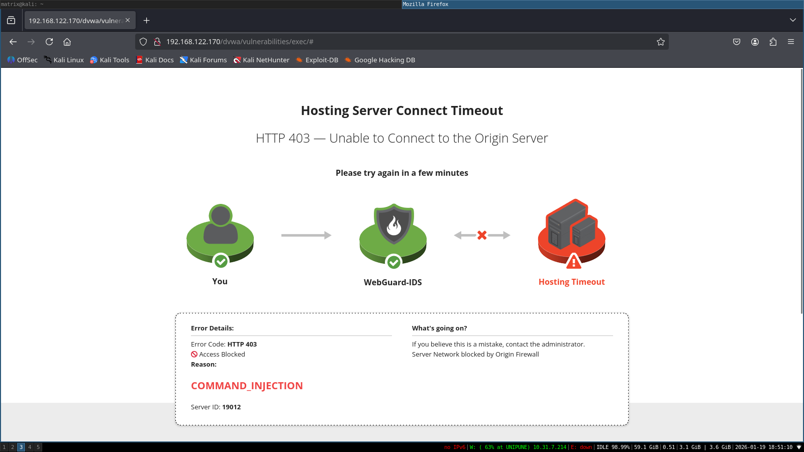
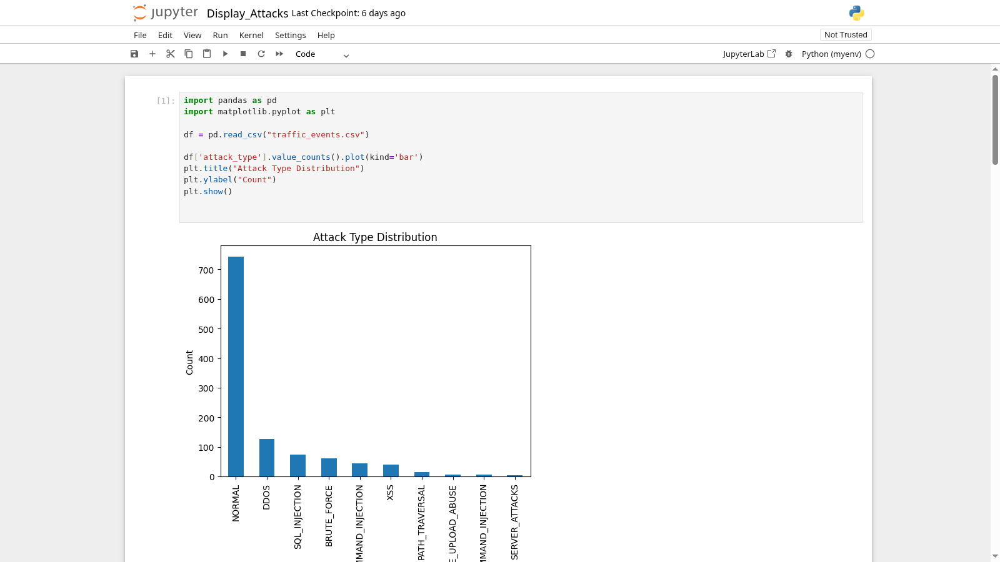
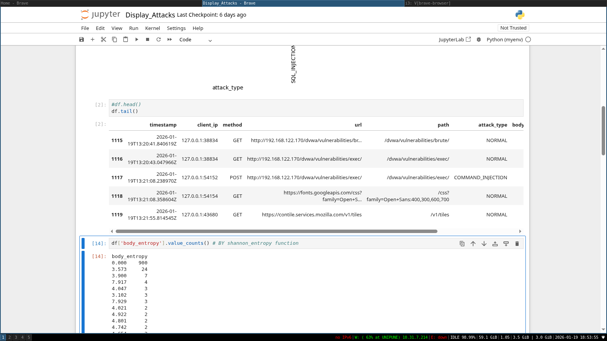
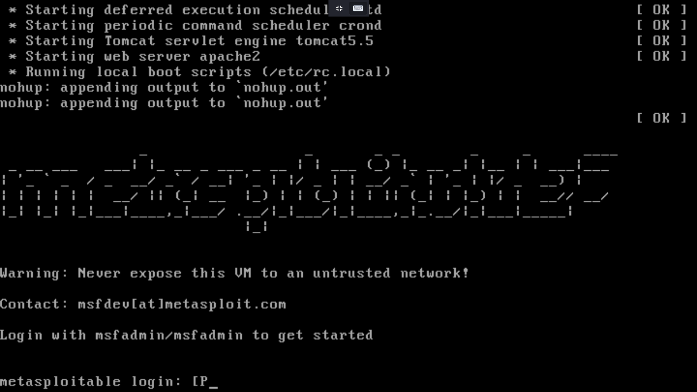
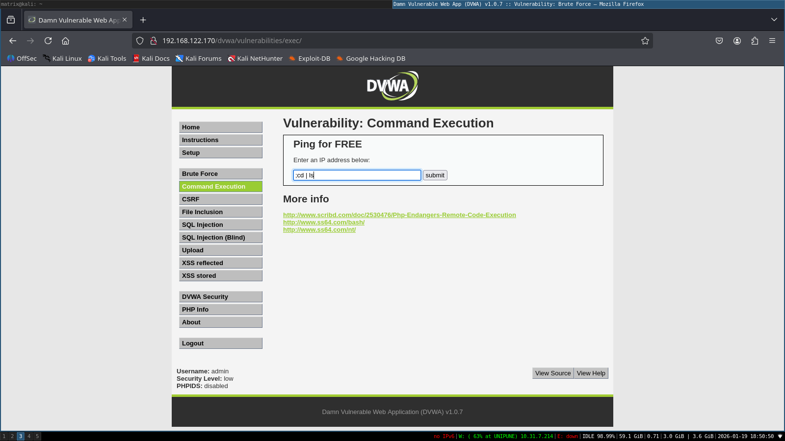
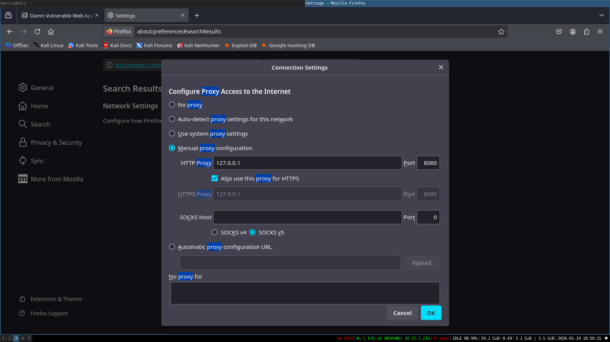

# IntelliWAF – Intelligent Web Intrusion Detection & Prevention System

IntelliWAF is a simple **Web Application Firewall (WAF)** written in Python using **mitmproxy**.  
It monitors requests and blocks malicious traffic before it reaches the server.


## What This Project Does

Checks every incoming HTTP/HTTPS request and:

- Detects common web attacks OWASP:https://owasp.org/www-project-top-ten/
- Blocks attackers automatically
- Limits too many requests from one IP
- Stops brute-force login attempts
- Logs all traffic into a CSV file

## Attacks It Can Detect


### Web Attacks
- SQL Injection
- Cross-Site Scripting (XSS)
- Command Injection
- Path Traversal
- NoSQL Injection

### Server Attacks
- SSTI attacks
- XXE attacks
- CRLF injection
- Prototype Pollution

### File Upload Attacks
- Blocks dangerous files like:
  - `.php`, `.py`, `.exe`, `.sh`,`etc`
- Blocks double extensions like:
  - `image.php.jpg`,`etc`
- Allows safe files:
  - `.png`, `.jpg`, `.pdf`, `.txt`,`etc`


## DDoS Protection

- Limits number of requests per IP
- Blocks IP if request limit is exceeded
- Automatically unblocks after a short time


## Brute Force Protection

- Monitors login pages:
  - `/login`
  - `/signin`
  - `/admin`
  - `/forgetpassword`
- Blocks IP after repeated login attempts

## Logging System

All requests are saved in **`traffic_events.csv`** with:

- Time and date
- Client IP address
- Request method
- URL path
- Attack type
- Request body length
- Request entropy

## Entropy Checking

- Measures how random the request body is
- High entropy = suspicious or encoded data
- Low entropy = normal user input

This helps detect hidden attacks.

## Input Encoding & Normalization
- This helps detect hidden or obfuscated payloads that attackers try to bypass security filters with.

# How? ->
- URL decoding
- Decodes encoded payloads (example: %27%20OR%201%3D1)
- Supports multiple levels of encoding

- HTML entity decoding
- Converts encoded characters like &lt; into <

- Unicode normalization
- Converts visually similar characters into standard form
- Prevents Unicode bypass attacks

- Lowercasing
- Makes detection case-insensitive

- Comment removal
- Removes SQL and JavaScript comments used to hide attacks

- Whitespace normalization
- Collapses extra spaces, tabs, and new lines

## Live Testing Using Metasploitable


# Web Page


- IntelliWAF was tested in a live attack environment using Metasploitable, a deliberately vulnerable virtual machine used for security testing.
- This allows real attacks to be generated and verified in real time.

# How? ->

# Test Environment

1: Attacker Machine: Kali Linux

2: Target Machine: Metasploitable

3: WAF: IntelliWAF (mitmproxy-based)

4: Traffic routed through the WAF proxy


## Project Files

 IntelliWAF - |

 | --- IntelliWAF.py      #Main firewall script
 | --- attacks.py         #Attacks detection logic
 | --- traffic_events.csv # Request logs
 | --- WAF_blocked.html   # Blocked page
 | --- README.md          # Project description
 | --- Display_Attacks.ibynb #Display logs
 

 ## How to Setup SentinelFlow

This section explains how to set up and run IntelliWAF in a simple lab environment.

### Requirements

- Python 3.x
- mitmproxy
- Kali Linux (attacker machine)
- Metasploitable (target server)
- Any browser or testing tool (curl, browser, sqlmap)

### Step 1: Install mitmproxy
Install mitmproxy using pip:

```bash
pip install mitmproxy
```

### Step 2: Setup & Start Metasploitable
- command for Metasploitable

```bash
ifconfig #To get ip of this machine
```
### Step 3: Run code IntelliWAF.py using mitmdump
```bash
mitmdump -s IntelliWAF.py  -p 8080 --listen-host 127.0.0.1
```

### Step 4: Setup Proxy in Browser

- ip: 127.0.0.1
- port: 8080
- Do for both HTTP & HTTPS


### Step 5:Test Attacks on Metasploitable ip :)
```bash
#Visit
192.168.***.***/dvwa
```
